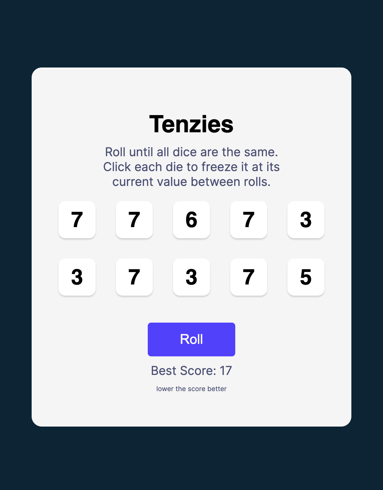

# Tenzies Dice Game

## Overview

Tenzies is a simple dice game where the objective is to roll the dice until all the dice show the same value. Click each die to freeze it at its current value between rolls. Try to achieve the lowest score possible!



## How to Play

1. Click the "Roll" button to roll the dice.
2. Click on individual dice to freeze their values.
3. Continue rolling until all dice show the same value.
4. The lower your score (number of rolls), the better!

## Features

- Randomly generated dice values.
- Interactive UI for freezing dice.
- Confetti celebration when you achieve Tenzies!
- Keeps track of your best score (lowest number of rolls).

## Installation

1. Clone the repository to your local machine:

   ```bash
   git clone https://github.com/yourusername/tenzies-dice-game.git
2. Navigate to the project directory:

    ```bash
    cd tenzies-dice-game
3. Install dependencies:
   
   ```bash
   npm install
3. Install dependencies:
   
   ```bash
   npm run dev
4. Open your web browser and visit http://localhost:3000 to play the game.